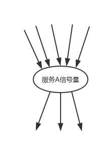
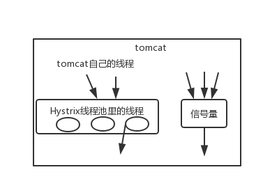

## Hystrix 隔离策略细粒度控制

Hystrix 实现资源隔离，有两种策略：

-   线程池隔离
-   信号量隔离

对资源隔离这一块东西，其实可以做一定细粒度的一些控制。

### execution.isolation.strategy

指定了 HystrixCommand.run() 的资源隔离策略：`THREAD` or `SEMAPHORE`，一种基于线程池，一种基于信号量。

```java
// to use thread isolation
HystrixCommandProperties.Setter().withExecutionIsolationStrategy(ExecutionIsolationStrategy.THREAD)

// to use semaphore isolation
HystrixCommandProperties.Setter().withExecutionIsolationStrategy(ExecutionIsolationStrategy.SEMAPHORE)
```

线程池机制，每个 command 运行在一个线程中，限流是通过线程池的大小来控制的；信号量机制，command 是运行在调用线程中（也就是 Tomcat 的线程池），通过信号量的容量来进行限流。

如何在线程池和信号量之间做选择？

**默认的策略**就是线程池。

**线程池**其实最大的好处就是对于网络访问请求，如果有超时的话，可以避免调用线程阻塞住。

而使用信号量的场景，通常是针对超大并发量的场景下，每个服务实例每秒都几百的 `QPS`，那么此时你用线程池的话，线程一般不会太多，可能撑不住那么高的并发，如果要撑住，可能要耗费大量的线程资源，那么就是用信号量，来进行限流保护。一般用信号量常见于那种基于纯内存的一些业务逻辑服务，而不涉及到任何网络访问请求。

### command key & command group

我们使用线程池隔离，要怎么对**依赖服务**、**依赖服务接口**、**线程池**三者做划分呢？

每一个 command，都可以设置一个自己的名称 command key，同时可以设置一个自己的组 command group。

```java
private static final Setter cachedSetter = Setter.withGroupKey(HystrixCommandGroupKey.Factory.asKey("ExampleGroup"))
                                                 .andCommandKey(HystrixCommandKey.Factory.asKey("HelloWorld"));

public CommandHelloWorld(String name) {
    super(cachedSetter);
    this.name = name;
}
```

command group 是一个非常重要的概念，默认情况下，就是通过 command group 来定义一个线程池的，而且还会通过 command group 来聚合一些监控和报警信息。同一个 command group 中的请求，都会进入同一个线程池中。

### command thread pool

ThreadPoolKey 代表了一个 HystrixThreadPool，用来进行统一监控、统计、缓存。默认的 ThreadPoolKey 就是 command group 的名称。每个 command 都会跟它的 ThreadPoolKey 对应的 ThreadPool 绑定在一起。

如果不想直接用 command group，也可以手动设置 ThreadPool 的名称。

```java
private static final Setter cachedSetter = Setter.withGroupKey(HystrixCommandGroupKey.Factory.asKey("ExampleGroup"))
                                                 .andCommandKey(HystrixCommandKey.Factory.asKey("HelloWorld"))
                                                 .andThreadPoolKey(HystrixThreadPoolKey.Factory.asKey("HelloWorldPool"));

public CommandHelloWorld(String name) {
    super(cachedSetter);
    this.name = name;
}
```

### command key & command group & command thread pool

**command key** ，代表了一类 command，一般来说，代表了下游依赖服务的某个接口。

**command group** ，代表了某一个下游依赖服务，这是很合理的，一个依赖服务可能会暴露出来多个接口，每个接口就是一个 command key。command group 在逻辑上对一堆 command key 的调用次数、成功次数、timeout 次数、失败次数等进行统计，可以看到某一个服务整体的一些访问情况。**一般来说，推荐根据一个服务区划分出一个线程池，command key 默认都是属于同一个线程池的。**

比如说有一个服务 A，你估算出来服务 A 每秒所有接口加起来的整体 `QPS` 在 100 左右，你有一个服务 B 去调用服务 A。你的服务 B 部署了 10 个实例，每个实例上，用 command group 去对应下游服务 A。给一个线程池，量大概是 10 就可以了，这样服务 B 对服务 A 整体的访问 QPS 就大概是每秒 100 了。

但是，如果说 command group 对应了一个服务，而这个服务暴露出来的几个接口，访问量很不一样，差异非常之大。你可能就希望在这个服务对应 command group 的内部，包含对应多个接口的 command key，做一些细粒度的资源隔离。**就是说，希望对同一个服务的不同接口，使用不同的线程池。**

```
command key -> command group

command key -> 自己的 thread pool key
```

逻辑上来说，多个 command key 属于一个 command group，在做统计的时候，会放在一起统计。每个 command key 有自己的线程池，每个接口有自己的线程池，去做资源隔离和限流。

说白点，就是说如果你的 command key 要用自己的线程池，可以定义自己的 thread pool key，就 ok 了。

### coreSize

设置线程池的大小，默认是 10。一般来说，用这个默认的 10 个线程大小就够了。

```java
HystrixThreadPoolProperties.Setter().withCoreSize(int value);
```

### queueSizeRejectionThreshold

如果说线程池中的 10 个线程都在工作中，没有空闲的线程来做其它的事情，此时再有请求过来，会先进入队列积压。如果说队列积压满了，再有请求过来，就直接 reject，拒绝请求，执行 fallback 降级的逻辑，快速返回。


控制 queue 满了之后 reject 的 threshold，因为 maxQueueSize 不允许热修改，因此提供这个参数可以热修改，控制队列的最大大小。

```java
HystrixThreadPoolProperties.Setter().withQueueSizeRejectionThreshold(int value);
```

### execution.isolation.semaphore.maxConcurrentRequests

设置使用 SEMAPHORE 隔离策略的时候允许访问的最大并发量，超过这个最大并发量，请求直接被 reject。

这个并发量的设置，跟线程池大小的设置，应该是类似的，但是基于信号量的话，性能会好很多，而且 Hystrix 框架本身的开销会小很多。

默认值是 10，尽量设置的小一些，因为一旦设置的太大，而且有延时发生，可能瞬间导致 tomcat 本身的线程资源被占满。

```java
HystrixCommandProperties.Setter().withExecutionIsolationSemaphoreMaxConcurrentRequests(int value);
```


## 基于 Hystrix 信号量机制实现资源隔离

Hystrix 里面核心的一项功能，其实就是所谓的**资源隔离**，要解决的最最核心的问题，就是将多个依赖服务的调用分别隔离到各自的资源池内。避免说对某一个依赖服务的调用，因为依赖服务的接口调用的延迟或者失败，导致服务所有的线程资源全部耗费在这个服务的接口调用上。一旦说某个服务的线程资源全部耗尽的话，就可能导致服务崩溃，甚至说这种故障会不断蔓延。

Hystrix 实现资源隔离，主要有两种技术：

-   线程池
-   信号量

默认情况下，Hystrix 使用线程池模式。

前面已经说过线程池技术了，这一小节就来说说信号量机制实现资源隔离，以及这两种技术的区别与具体应用场景。

### 信号量机制

信号量的资源隔离只是起到一个开关的作用，比如，服务 A 的信号量大小为 10，那么就是说它同时只允许有 10 个 tomcat 线程来访问服务 A，其它的请求都会被拒绝，从而达到资源隔离和限流保护的作用。



### 线程池与信号量区别

线程池隔离技术，并不是说去控制类似 tomcat 这种 web 容器的线程。更加严格的意义上来说，Hystrix 的线程池隔离技术，控制的是 tomcat 线程的执行。Hystrix 线程池满后，会确保说，tomcat 的线程不会因为依赖服务的接口调用延迟或故障而被 hang 住，tomcat 其它的线程不会卡死，可以快速返回，然后支撑其它的事情。

线程池隔离技术，是用 Hystrix 自己的线程去执行调用；而信号量隔离技术，是直接让 tomcat 线程去调用依赖服务。信号量隔离，只是一道关卡，信号量有多少，就允许多少个 tomcat 线程通过它，然后去执行。



**适用场景**：

-   **线程池技术**，适合绝大多数场景，比如说我们对依赖服务的网络请求的调用和访问、需要对调用的 timeout 进行控制（捕捉 timeout 超时异常）。
-   **信号量技术**，适合说你的访问不是对外部依赖的访问，而是对内部的一些比较复杂的业务逻辑的访问，并且系统内部的代码，其实不涉及任何的网络请求，那么只要做信号量的普通限流就可以了，因为不需要去捕获 timeout 类似的问题。

### 信号量简单 Demo

业务背景里，比较适合信号量的是什么场景呢？

比如说，我们一般来说，缓存服务，可能会将一些量特别少、访问又特别频繁的数据，放在自己的纯内存中。

举个栗子。一般我们在获取到商品数据之后，都要去获取商品是属于哪个地理位置、省、市、卖家等，可能在自己的纯内存中，比如就一个 Map 去获取。对于这种直接访问本地内存的逻辑，比较适合用信号量做一下简单的隔离。

优点在于，不用自己管理线程池啦，不用 care timeout 超时啦，也不需要进行线程的上下文切换啦。信号量做隔离的话，性能相对来说会高一些。

假如这是本地缓存，我们可以通过 cityId，拿到 cityName。

```java
public class LocationCache {
    private static Map<Long, String> cityMap = new HashMap<>();

    static {
        cityMap.put(1L, "北京");
    }

    /**
     * 通过cityId 获取 cityName
     *
     * @param cityId 城市id
     * @return 城市名
     */
    public static String getCityName(Long cityId) {
        return cityMap.get(cityId);
    }
}
```

写一个 GetCityNameCommand，策略设置为**信号量**。run() 方法中获取本地缓存。我们目的就是对获取本地缓存的代码进行资源隔离。

```java
public class GetCityNameCommand extends HystrixCommand<String> {

    private Long cityId;

    public GetCityNameCommand(Long cityId) {
        // 设置信号量隔离策略
        super(Setter.withGroupKey(HystrixCommandGroupKey.Factory.asKey("GetCityNameGroup"))
                .andCommandPropertiesDefaults(HystrixCommandProperties.Setter()
                        .withExecutionIsolationStrategy(HystrixCommandProperties.ExecutionIsolationStrategy.SEMAPHORE)));

        this.cityId = cityId;
    }

    @Override
    protected String run() {
        // 需要进行信号量隔离的代码
        return LocationCache.getCityName(cityId);
    }
}
```

在接口层，通过创建 GetCityNameCommand，传入 cityId，执行 execute() 方法，那么获取本地 cityName 缓存的代码将会进行信号量的资源隔离。

```java
@RequestMapping("/getProductInfo")
@ResponseBody
public String getProductInfo(Long productId) {
    HystrixCommand<ProductInfo> getProductInfoCommand = new GetProductInfoCommand(productId);

    // 通过command执行，获取最新商品数据
    ProductInfo productInfo = getProductInfoCommand.execute();

    Long cityId = productInfo.getCityId();

    GetCityNameCommand getCityNameCommand = new GetCityNameCommand(cityId);
    // 获取本地内存(cityName)的代码会被信号量进行资源隔离
    String cityName = getCityNameCommand.execute();

    productInfo.setCityName(cityName);

    System.out.println(productInfo);
    return "success";
}
```
