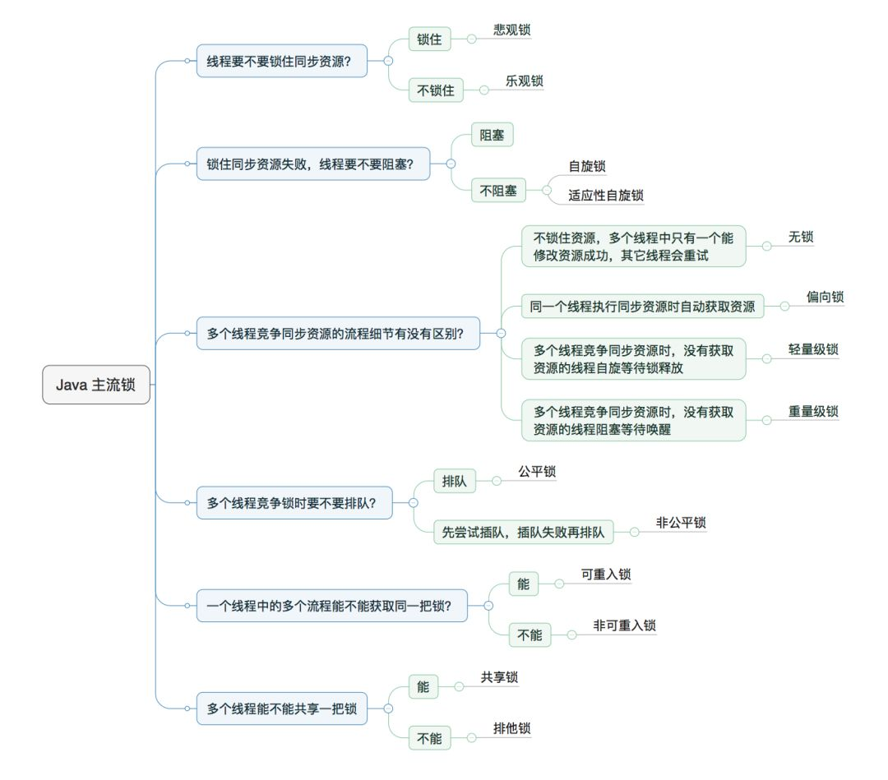
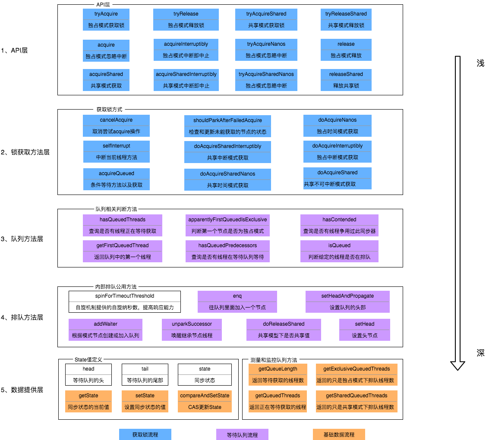

## Java

https://www.cnblogs.com/chengxy-nds/p/12893407.html

> ### 笔记点
>> #### 参考文档地址
>> 关键词：**
>
>> 内容
>
>
>

> ### Arthas(阿尔萨斯)
>> #### https://arthas.aliyun.com/doc/commands.html
>> 关键词： Arthas(阿尔萨斯)
>
>> dashboard 数据面板  
> monitor -c 5 package.Class method : 获取统计周期(5秒)内方法method的调用情况(调用次数、成功失败数)  
> stack package.Class method : 输出当前方法被调用的调用路径  
> trace package.Class method : 方法内部调用路径，并输出方法路径上的每个节点上耗时  
> watch package.Class method -x 2 : watch主要关注方法入参和出参。命令定义了 4 个观察事件点，即 -b 函数调用前，-e 函数异常后，-s 函数返回后，-f 函数结束后（默认）  
> tt -t Class method /  tt -i INDEX ： 方法执行数据的时空隧道，记录下指定方法每次调用的入参和返回信息，并能对这些不同的时间下调用进行观测
> getstatic package.Class field ： 获取类静态属性信息  
> thread --all : 显示所有匹配的线程 / thread -b : 找出当前阻塞其他线程的线程  
>

> ### :Linux 物理CPU及逻辑CPU
>> #### https://blog.csdn.net/LuMaman/article/details/124933884   https://www.cnblogs.com/dw3306/p/12551327.html
>> 关键词：内核、物理CPU、超线程技术、逻辑CPU、线程数
>
>> 单内核多处理器，每个处理器对应一个逻辑CPU,即对应一个线程数
> 所谓的4核8线程，4核指的是物理核心。通过超线程技术，用一个物理核模拟两个虚拟核，每个核两个线程，总数为8线程。  
>【逻辑CPU数量和型号】  
cat /proc/cpuinfo | grep name | cut -f2 -d: | uniq -c  
【物理CPU数量】  
cat /proc/cpuinfo | grep "physical id" | sort | uniq | wc -l   
【物理CPU内核的个数】（1个物理CPU里面有几个物理内核）  
cat /proc/cpuinfo | grep "cpu cores" | uniq  
【查看所有逻辑CPU的个数】  
cat /proc/cpuinfo | grep "processor" | wc -l  
【物理CPU中逻辑CPU的个数】（如果不使用超线程技术，则此值和物理CPU内核数量一致；不一致则为整倍数）  
cat /proc/cpuinfo | grep 'siblings' | uniq  
【超线程】（分别输出cpu cores和siblings数量，使用超线程则后者翻倍）  
cat /proc/cpuinfo | grep -e "cpu cores" -e "siblings" | sort | uniq  
>

> ### mybatis一二级缓存
>> #### https://tech.meituan.com/2018/01/19/mybatis-cache.html
>> 关键词：**
>
>> 一级缓存因为只能在同一个SqlSession中共享，所以会存在一个问题，在分布式或者多线程的环境下，
不同会话之间对于相同的数据可能会产生不同的结果，因为跨会话修改了数据是不能互相感知的，所以就有可能存在脏数据的问题，
正因为一级缓存存在这种不足，所以我们需要一种作用域更大的缓存，这就是二级缓存。 
>Cache使用时的注意事项/避免使用二级缓存  
    注意事项：  
    只能在【只有单表操作】的表上使用缓存，不只是要保证这个表在整个系统中只有单表操作，而且和该表有关的全部操作必须全部在一个namespace下。
    在可以保证查询远远大于insert,update,delete操作的情况下使用缓存这一点不需要多说，所有人都应该清楚(读多写少)。记住，这一点需要保证在1的前提下才可以！
    避免使用二级缓存：
    可能会有很多人不理解这里，二级缓存带来的好处远远比不上他所隐藏的危害。
    缓存是以namespace为单位的，不同namespace下的操作互不影响。
    insert,update,delete操作会清空所在namespace下的全部缓存。
    通常使用MyBatis Generator生成的代码中，都是各个表独立的，每个表都有自己的namespace。
>
>

> ### 锁及AQS原理
>> #### https://tech.meituan.com/2019/12/05/aqs-theory-and-apply.html   https://tech.meituan.com/2018/11/15/java-lock.html    https://www.cnblogs.com/tyux/articles/15886521.html
>> 关键词：按位切割：一个值表示多个意
>
>> 乐观锁：CAS无锁算法-ABA问题（AtomicStampedReference类来解决ABA问题）、 J.U.C 原子类、并发容器、GIT PUSH
> 自旋锁：避免切换线程的开销，因为阻塞或唤醒一个Java线程需要操作系统切换CPU状态来完成  
> AQS，两个队列，一个同步(等待)队列[虚拟双向队列（FIFO）]，多个条件队列，await等待会让线程从同步队列转移到条件队列，signal唤醒会让线程由条件队列转移至同步队列  
> 一个volatile状态state(表示锁状态、锁次数（可重入锁）、按位切割（高16位表示读锁状态（读锁个数），低16位表示写锁状态（写锁个数））
> 同步队列的作用是：当线程获取资源失败之后，就进入同步队列的尾部保持自旋等待，不断判断自己是否是链表的头节点，如果是头节点，就不断参试获取资源，获取成功后则退出同步队列。
条件队列是为Lock实现的一个基础同步器，并且一个线程可能会有多个条件队列，只有在使用了Condition才会存在条件队列 
> 
 
> ### 分布式事务
>> #### https://www.cnblogs.com/chengxy-nds/p/14046856.html  https://blog.51cto.com/u_14299052/3152345  http://www.hunt007.com/wiki/97874.html
>> 关键词：**
>
>> 分布式事务之TCC (事务补偿) 
> 分布式事务之最大努力通知型事务  
> 柔性事务解决方案：消息一致性事务方案
> 消息事务
> 总结
可靠消息最终一致性方案是目前业务主流的分布式事务落地方案，其优缺点主要如下：
优点： 消息数据独立存储，降低业务系统与消息系统间的耦合。
缺点： 一次消息发送需要两次请求，业务服务需要提供消息状态查询的回调接口。

SpringCloud包含的组件很多，有很多功能是重复的。其中最常用组件包括：
•注册中心组件：Eureka、Nacos等
•负载均衡组件：Ribbon
•远程调用组件：OpenFeign
•网关组件：Zuul、Gateway
•服务保护组件：Hystrix、Sentinel
•服务配置管理组件：SpringCloudConfig、Nacos

> ### Feign
>> #### https://blog.csdn.net/BASK2311/article/details/128048199
>> 关键词：**
>
>> 内容
>

> ### hystrix与sentinel熔断降级
>> #### https://github.com/alibaba/Sentinel/wiki/Sentinel-%E4%B8%8E-Hystrix-%E7%9A%84%E5%AF%B9%E6%AF%94
>> 关键词：**
>
>> 内容
>

> ### 系统架构
>> #### 参考文档地址  
>> 关键词：**
>

> ### 多线程参数传递
>> ####  https://blog.csdn.net/fuliyingIT/article/details/128603599   https://www.cnblogs.com/throwable/p/12817754.html
>> 关键词：ThreadLocal、InheritableThreadLocal(可遗传本地线程)、TransmittableThreadLocal(可传递本地线程)、TaskDecorator(线程池设置)
>
>> - TheadLocal单个线程生命周期强绑定，只能在某个线程的生命周期内对ThreadLocal进行存取，不能跨线程存取。
>> - InheritableThreadLocal这种方案不建议使用，在线程池中使用会存在失败的问题，原因：InheritableThreadLocal 在父线程创建子线程的时候，会将父线程当前存在的本地线程变量拷贝到子线程的本地线程变量中，但是在web的容器中使用了线程池，线程会被创建回收重复的利用，不会被销毁重新创建，所以会存在失效的场景。  
>> - TransmittableThreadLocal是阿里开源的工具，在线程提交的时候要进行上下文的复制,解决了InheritableThreadLocal不能进行线程池间传递数据的缺陷，在使用线程池等会池化复用线程的执行组件情况下，提供ThreadLocal值的传递功能，解决异步执行时上下文传递的问题。  
>> - TaskDecorator线程池提供，这是一个执行回调方法的装饰器，主要应用于多线程间传递上下文，或者提供任务的监控/统计信息。  
>> 示例：ThreadApp.java
>

> ### Spring - 三级缓存 + 循环依赖解决
>> #### https://www.cnblogs.com/frankcui/p/13449973.html  
>> Spring为上层应用提供bean的生命周期管理。二级缓存是为了解决循环依赖，三级缓存就是给AOP动态代理准备的，进行提前爆光对象而不生成代理对象。三级缓存实例化bean[只生成引用]，会自动升级到二级缓存，初始化完成，升级为一级缓存  
>
>> - singletonObjects：用于存放完全初始化好的 bean，从该缓存中取出的 bean 可以直接使用  
>> - earlySingletonObjects：提前曝光的单例对象的cache，存放原始的 bean 对象（尚未填充属性），用于解决循环依赖  
>> - singletonFactories：单例对象工厂的cache，存放 bean 工厂对象，用于动态代理对象
> 

> ### Zookeeper集群“脑裂”问题处理
>> #### https://blog.51cto.com/mingongge/3063433  
>> 关键词：Zookeeper容错、奇数部署、过半机制、假死、Leader、follower、Quorums(法定人数)、epoch(标号)  
>
>> 脑裂：由于假死会发起新的Leader选举，选举出一个新的Leader，但旧的Leader网络又通了，导致出现了两个Leader ，有的客户端连接到老的Leader，而有的客户端则连接到新的leader。 
ZooKeeper默认采用了Quorums这种方式来防止"脑裂"现象。 
假设某个Leader假死，其余的followers选举出了一个新的Leader。这时，旧的Leader复活并且仍然认为自己是Leader，这个时候它向其他followers发出写请求也是会被拒绝的。
因为每当新Leader产生时，会生成一个epoch标号(标识当前属于那个Leader的统治时期)，这个epoch是递增的，followers如果确认了新的Leader存在，知道其epoch，就会拒绝epoch小于现任Leader epoch的所有请求。
那有没有follower不知道新的Leader存在呢？有可能，但肯定不是大多数，否则新Leader无法产生。Zookeeper的写也遵循quorum机制，因此，得不到大多数支持的写是无效的，旧Leader即使各种认为自己是leader，依然没有什么作用。
>

> ### RabbitMq
>> #### https://github.com/powerLeePlus/java-samples/tree/master/rabbitmq    
>> 关键词：交换机、路由、消息、持久化、Ack机制、消费者确认：basicAck、消费者拒绝：basicNack、生产者确认的两种模式：事务与confirm机制 
>
>> 当你声明了一个名为”hello_queue”的队列，RabbitMQ会自动将其绑定到默认交换机上，绑定（binding）的路由键名称也是为”hello_queue”,消费者通过绑定的路由进行消费。 
> 如果要设置重回队列的话，要设置最大处理次数，例如为3，记录消费者处理失败的次数，当处理失败次数小于3调用Nack重回队列；如果达到了最大重试次数，则调用Ack删除消息，同时持久化该消息，后期采用定时任务或者手工处理。
> - Fanout exchange（扇型交换机）- Publish/Subscribe（发布订阅） - 一对多消费
> - Direct exchange（直连交换机）- 够对消息按照一定的规则进行转发，消息会被推送至binding key和消息routing key完全匹配的队列，即使用特定的 binding key发送消息 - 一对一消费
> - Topic exchange（主题交换机）- 发送到topic交换机的消息不能具有任意的  routing_key —— 它必须是由点分隔的单词列表   
    > \*（星号）可以替代一个单词， ＃（hash）可以替换零个或多个单词, 主题类型的转发器非常强大，可以实现其他类型的转发器。  
    当一个队列与绑定键#绑定，将会收到所有的消息，类似fanout类型转发器。    
    当绑定键中不包含任何#与\*时，类似direct类型转发器。
> - Dead Letter Exchange（DLX-死信交换机）  
    > 死信消息有如下几种情况：1、消息被拒绝(Basic.Reject/Basic.Nack) ，井且设置requeue(重回队列) 参数为false ; 2、消息过期 ; 3、队列达到最大长度
>

> ### java相关学习示例
>> #### https://github.com/powerLeePlus/java-samples  
>> 这里有很多示例，可以学习

 